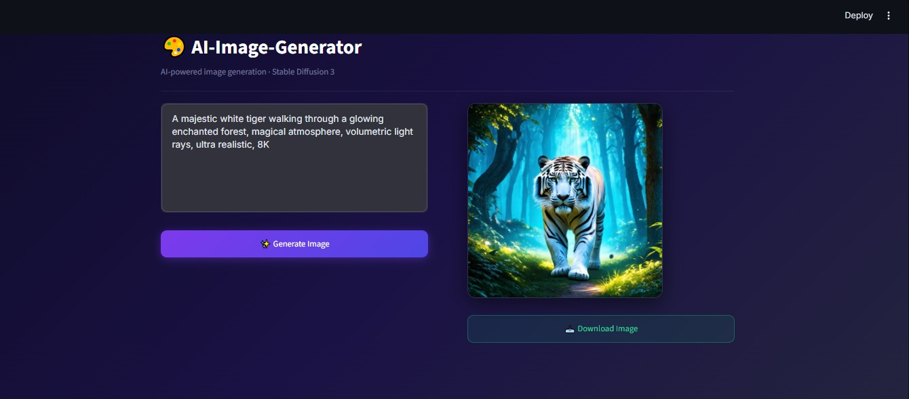

# 🎨 AI — Image Generator

A simple, clean AI image generator built with **Streamlit** and **Hugging Face**.

---

## ScreenShot



---

## 📸 What It Does

- Enter a text prompt
- Click **Generate Image**
- View the AI-generated image (small preview, 320×320)
- Download it as a PNG

---

## 🚀 Getting Started

### 1. Install dependencies

```bash
pip install streamlit huggingface-hub 
```

### 2. Set your Hugging Face API key

```bash
# Windows PowerShell
$env:HF_API_KEY = "hf_your_token_here"

# Windows CMD
set HF_API_KEY=hf_your_token_here
```

> Get a free API key at: https://huggingface.co/settings/tokens

### 3. Run the app

```bash
streamlit run app.py
```

Open **http://localhost:8501** in your browser.

---

## 🗂️ Project Structure

```
Ai-Image-Generator/
├── app.py              # Main Streamlit app
├── requirements.txt    # Python dependencies
├── .env.example        # API key template
└── README.md           # This file
```

---

## ⚙️ Model Used

| Model | Provider |
|---|---|
| `stabilityai/stable-diffusion-3-medium-diffusers` | Stability AI via Hugging Face Inference API |

---


## 📄 License

MIT License


## Author

**Muhammad Talha** — Built using HggingFace & Streamlit.
